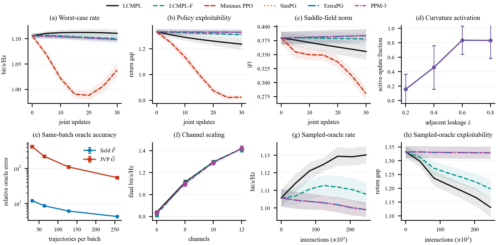

# Lyapunov-Controlled Minimax Policy Learning

This repository contains the manuscript, code, locked data, and figure pipeline for **“Lyapunov-Controlled Minimax Policy Learning for Adversarial Dynamic Spectrum Access.”** The work studies simultaneous transmitter–jammer policy learning in an adversarial dynamic-spectrum-access Markov game.

LCMPL combines a policy-gradient saddle field with a Jacobian–field correction. A two-variable local Lyapunov model selects their step sizes. The communication-aware merit links learning stability to worst-case spectral efficiency.



## Repository contents

- `ICC2027_submit.tex` and `ICC2027_submit.pdf`: submission manuscript.
- `ICC2027_camera_ready.tex` and `ICC2027_camera_ready.pdf`: full-author-metadata manuscript.
- `experiments/`: population-oracle, trajectory-sampled, wireless-stress, oracle-quality, and plotting code.
- `results/`: locked per-seed CSV/JSON files used by the reported figures and numerical claims.
- `figures/`: the mathematical-motivation, wireless-system, and learning-framework figures.
- `scripts/reproduce.py`: one entry point for smoke tests, figures, full experiments, and paper compilation.
- `scripts/verify_release.py`: checks the locked artifact structure, seed coverage, data dimensions, and manuscript inputs.
- `docs/REPRODUCIBILITY.md`: protocols, budgets, commands, and artifact provenance.

The code labels the proposed method as `QP+G` and its field-only ablation as `noG`. These correspond to **LCMPL** and **LCMPL-F**, respectively, in the manuscript.

## Quick start

The locked environment used Python 3.8.12, PyTorch 1.11.0 CPU, NumPy 1.20.3, SciPy 1.7.3, pandas 1.4.1, and Matplotlib 3.5.1.

```bash
conda env create -f environment.yml
conda activate lcmpl-icc2027
python scripts/verify_release.py
python scripts/reproduce.py figures
```

Compile both six-page manuscripts with an IEEEtran-compatible TeX installation:

```bash
python scripts/reproduce.py paper
```

Run a short end-to-end CPU check:

```bash
python scripts/reproduce.py smoke
```

Run the complete fixed-seed experiment suite in a new output directory:

```bash
python scripts/reproduce.py full
```

The full CPU suite takes roughly 20–30 minutes on the development machine. It never overwrites the committed results. See [docs/REPRODUCIBILITY.md](docs/REPRODUCIBILITY.md) for the exact seeds, budgets, outputs, and interpretation of the locked artifacts.

## Figure provenance

- Fig. 1 is generated by `experiments/plot_math_motivation.py`.
- Figs. 2–3 are locked vector artwork for the communication system and learning framework.
- Figs. 4–5 are generated by `experiments/plot_theory_aligned_icc.py` from the committed CSV files.

The release stores raw per-seed data rather than only aggregate plots. No seed was selected, dropped, replaced, or reordered based on outcomes.

## Status

This repository accompanies a manuscript prepared for IEEE ICC 2027. It does not claim acceptance, a DOI, or an arXiv identifier.
